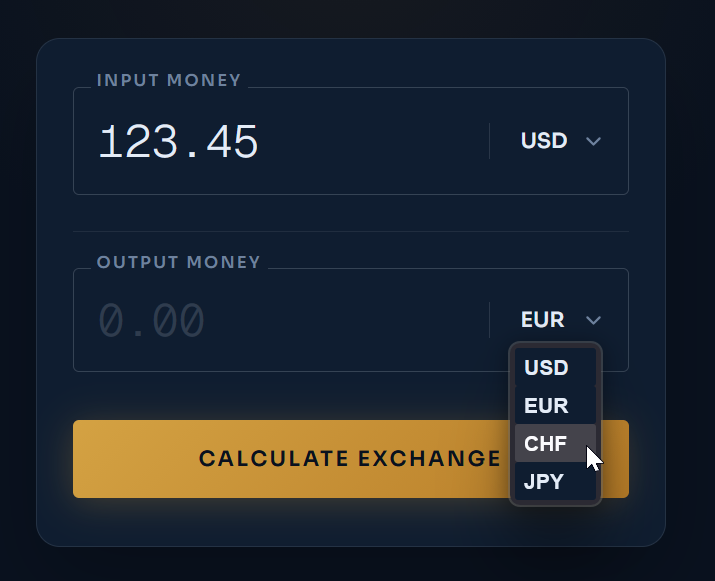

# Work in Progress

HOTest is undergoing changes aimed at simplification.

For the old version, see [README_old_deprecated.md](README_old_deprecated.md).

# Sample: Currency Exchange App

Let's assume you are building an app for calculating currency conversions.

The app has the following screen:



## Sample UI tests

```kotlin
@Test
fun `test default screen values`() = runComposeUiTest {
    
    val model = `init mock model`()
    model.`given model returns rates`("""
        | from | to  | rate |
        | USD  | EUR | 0.92 |
        | USD  | CHF | 0.80 |
        | EUR  | JPY | 171  |
    """)

    `when user opens main screen`(model)
    
    `then input currency dropdown is`("not selected")
    `then input currency dropdown values are`("USD, EUR, CHF, JPY")
    `then output currency dropdown is`("not selected")
    `then output currency dropdown values are`("empty list")
}
```

```kotlin
@Test
fun `test currency switching`() = runComposeUiTest {
    
    val model = `init mock model`()
    model.`given model returns rates`("""
        | from | to  | rate |
        | USD  | EUR | 0.92 |
        | USD  | CHF | 0.80 |
        | EUR  | JPY | 171  |
    """)

    `when user opens main screen`(model)

    `when user selects input currency`("USD")

    `then input currency dropdown is`("USD")
    `then output currency dropdown is`("EUR") // The app automatically suggests the first pair
    `then output currency dropdown values are`("EUR, CHF") // The app shows only available conversions

    `when user selects input currency`("JPY")

    `then input currency dropdown is`("JPY")
    `then output currency dropdown is`("USD")
    `then output currency dropdown values are`("USD")
}
```